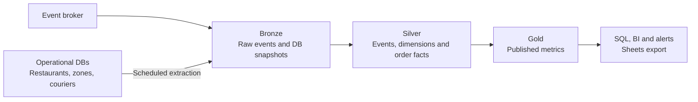
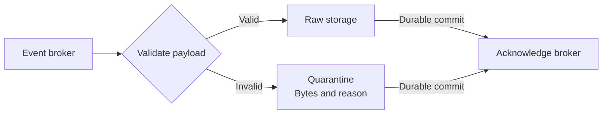
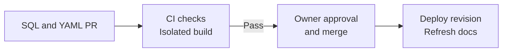
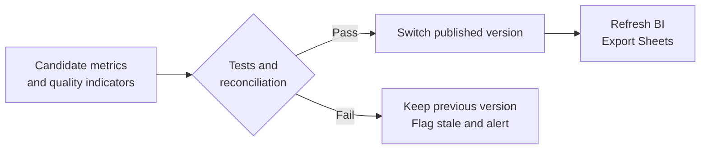

# Nomly Self-Service Event Data Platform

## 1. Executive Summary

Give analysts a shared dbt SQL/YAML monorepo for declaring datasets without writing consumers. Keep raw events for audit and replay; derive order facts and centrally defined metrics for Dispatch.

- **Storage and compute:** Lakehouse approach - Parquet in Iceberg tables on object storage; dbt Core runs SQL on Trino.
- **One declarative codebase:** Scheduled batch, near-real-time microbatches and backfills reuse the same models, contracts and tests. Execution schedules and input ranges differ; business logic does not.
- **Trade-off:** One transformation path reduces maintenance and batch/stream drift, but offers no continuous streaming or sub-minute latency. Iceberg adds maintenance overhead at today's scale.
- **Serving:** Governed SQL access, a BI dashboard and alerts, plus a controlled Google Sheets export.

This is a proposed architecture. The five-minute freshness target needs benchmarking; the working slice in section 10 is not yet implemented.

## 2. Requirements and Assumptions

### Users and Requirements

| User | Required outcome |
|---|---|
| Chiara, Operations | Detect late-delivery regressions by zone within minutes to inform rollout decisions |
| Bea, Product | Compare v1/v2 and use her Sheets template for presentation |
| Tomek, Analytics | Declare events, fields and transformations without a platform ticket |

The offline-app incident requires event-time aggregation. Rollout decisions require visible sample sizes, data-quality gaps and freshness; pipeline completion alone does not establish trust.

### Provisional Assumptions

- **Freshness:** Publish validated results within five minutes of broker receipt under normal operation. Critical jobs start every two minutes; ingestion, scheduling, computation and checks share the budget. Trigger dashboard refresh on publication. Pending corrections do not count as refreshed results; source outages remain a separate visibility gap.
- **Time:** UTC event time; automatic metric corrections for 24 hours after window end. Older arrivals require explicit backfill. Expiry does not establish completeness.
- **Metric:** Placement-to-delivery duration strictly greater than 45 minutes; exclude cancellations and report incomplete orders separately.
- **Scale and retention:** A few hundred orders/minute today; assess 100x. Retain raw data for 90 days provisionally, subject to privacy and replay needs.

### Questions Before Production

| Question | Owner |
|---|---|
| Late definition, comparison window, minimum sample and alert threshold? | Product and Operations |
| Is five-minute freshness sufficient, and how late must automatic corrections remain possible? | Operations |
| Authoritative reconciliation source and historical restaurant/zone mappings? | Analytics and source owners |
| Courier access, retention and availability target? | Security and domain owner |

## 3. Architecture

### Flow and Storage



Raw events, database snapshots and derived tables use the same storage layer. A REST-compatible Iceberg catalog locates table metadata and coordinates commits. Quarantine stores rejected bytes and reasons separately on object storage.

| Component | Decision and trade-off |
|---|---|
| Broker | Keep the existing broker; consider a replayable log only if retention or throughput requires it |
| Iceberg / Parquet | Portable storage, atomic table commits, snapshots/time travel, schema evolution and hidden/evolving partitions; requires maintenance |
| Trino + dbt Core | Shared SQL transformations and query access; incremental merges and adapter compatibility need validation |
| Orchestrator | Required for schedules, dependencies, retries and publication; prefer an existing scheduler, vendor unspecified |


**Why a lakehouse:** Open storage, ACID-compliance, replayable history and engine portability motivate this provisional choice. Portability is an assumed platform priority, not a requirement established by the brief. An existing managed warehouse may be simpler at today's scale; prefer it if portability does not justify operating Trino, a catalog and table maintenance. Neither lower cost nor the freshness target is established without benchmarks.

### Medallion Quality Contracts

| Layer | Existing data and quality guarantee |
|---|---|
| Bronze (replay safety net) | `raw_order_events` preserves accepted payloads and receipt metadata; DB snapshots preserve source rows and extraction metadata. Quarantine retains rejected bytes and reasons separately. Replayable within retention limits; duplicates and business-invalid events may remain |
| Silver (validated detail) | Staging events, dimension versions and `fct_orders`: enforce types, schema and required-field/null rules; deduplicate event IDs and quarantine conflicts. Missing lifecycle events or attribution remain explicit quality flags, not silently dropped orders |
| Gold (stakeholder outputs) | `dispatch_metrics` pre-aggregates by window, zone and algorithm. Publish only after tests and reconciliation, with definition version, freshness and quality indicators; failed candidates leave the prior version visible as stale |

Medallion defines progressively stronger quality contracts; dimensional modelling defines business grain and relationships. The approaches complement each other. A layer name alone does not guarantee correctness or completeness.

### Ingestion and Transformation



Acknowledge only after durable storage; retries may create raw duplicates. Raw retains payload, event ID, event time, ingestion time and source position where available.

- **Validation:** Registered, versioned JSON Schema per event type, using a validator such as [jsonschema](https://python-jsonschema.readthedocs.io/en/stable/validate/). Check required fields, types and timestamp formats; enable format checking explicitly. Preserve compatible additive fields.
- **Transformation:** Apply the timestamp and correction rules below; advance committed-batch checkpoints only after success. Publication checks are in section 6.
- **Dimensions:** Build validated dimensions from Bronze DB snapshots. Include changed mappings in affected-order selection; missing history remains a quality gap.

### Timestamps and Late-Arriving Facts

| Clock | Meaning and use |
|---|---|
| Event time (`occurred_at`) | Source-reported occurrence; lifecycle durations and business windows |
| Ingestion time (`ingested_at`) | Ingestion-service receipt; raw ingestion-day partitioning |
| Processing / publication time | When computation runs / validated results become visible; operational latency |

Offline buffering can change an already published window.

**Late arrival is distinct from a delivery taking >45 minutes.** A delivery at 23:50 received at 01:00 the next day belongs to the previous day's delivery window but the new day's raw partition. Measure freshness from broker receipt; `ingested_at` alone excludes queue backlog.

- **Discover:** Read newly committed raw batches regardless of event age; deduplicate by event ID and update affected orders. Timestamps alone are not processing checkpoints.
- **Correct:** Recompute affected windows within 24 hours after window end, provisionally. Replace prior contributions, including old and new groups when attribution changes. Retain older arrivals for explicit backfill; show pending corrections and quality gaps.
- **Replay:** Preserve event timestamps and original receipt metadata. Fix the run’s `as_of` when reproducing overdue-order calculations; execution time must not move business windows.

Normalize to UTC, quarantine invalid timestamps and flag suspect timing; never silently substitute ingestion time. Arrival delay (`ingested_at - occurred_at`) depends on source-clock accuracy.

### Operational Databases into Bronze

Events contain entity IDs; restaurant-to-zone mappings and courier attributes come from operational databases. Platform owns extraction; dbt transforms the landed data.

| Method | Decision and limits |
|---|---|
| Scheduled full snapshots | Default for these small, slow-moving tables: initial load, then daily provisionally. Simple, but misses intermediate changes and adds source scan load |
| Incremental polling | Consider for larger tables with reliable update markers and explicit deletion tracking. The harness has neither; polling can miss intermediate versions |
| Log-based CDC | Use an initial snapshot followed by inserts, updates and deletes when fresher dimensions or change history are required. Adds connector, checkpoint and source-log retention operations|
| Version-controlled seeds | Only for small, static reference mappings or test fixtures. [dbt seeds](https://docs.getdbt.com/docs/build/seeds) are not ongoing replication of operational tables; seeding the harness only initializes its source DB |

Store each consistent source snapshot with source/table, extraction time and batch ID; expose only completed batches. Compare complete snapshots by primary key to detect observed changes and deletions. Daily refresh assumes up to one day of dimension staleness is acceptable; show its freshness separately from event freshness and confirm with Operations.

Snapshot history records when a value was observed, not its exact business-effective time. CDC preserves captured database changes, but cannot recover earlier history or establish business-effective dates by itself. Exact historical zone attribution requires source-provided effective dates or an explicitly accepted approximation.

### Storage Decision

Keep append-only `raw_order_events` plus derived order and metric tables. Raw-only storage repeats lifecycle logic in every query; order-only storage loses replay evidence. Keeping both costs extra storage and mutable-table maintenance.

Partition raw by **ingestion day**, orders by placement day and metrics by window-start day. Keep missing-placement orders in an explicit unknown partition until corrected. Avoid minute-level or high-cardinality partitions. Pin raw snapshots, dimension versions and SQL revision for reproducible reprocessing; maintenance must protect those inputs.

## 4. Self-Service Interface

### Analyst Workflow



- **Declare:** Select registered inputs and write SQL with model settings in `config()`. Use supporting YAML for source declarations, column definitions, tests and downstream exposures.
- **Check and approve:** CI validates the change and affected downstream models in an isolated schema. Domain owners approve semantics; Platform reviews shared layers, new inputs and policy changes. The orchestrator deploys the approved revision.

Platform registers each source once; Tomek reuses its validated, deduplicated input without writing a consumer.

### What Tomek Submits

**Proposed example, not yet implemented.** The Postgres slice combines validation and deduplication in `raw.deliveries`; production keeps separate raw and staging layers.

**1. Tomek's checklist**

- [ ] Select a registered input.
- [ ] Write the SQL model; set its owner and freshness class.
- [ ] Declare output columns and tests.
- [ ] Register dashboard and Sheets dependencies as exposures.
- [ ] Open a PR; fix validation failures before owner approval.

**2. SQL model and configuration**

Model settings live next to the query. This example uses Postgres 16's `date_bin`; Trino needs its equivalent time-bucketing expression.

```sql
-- models/dispatch/delivery_counts.sql
{{ config(
    materialized='table',
    contract={'enforced': true},
    meta={
        'owner': 'dispatch',
        'freshness_class': 'critical'
    }
) }}

-- Full rebuild for the small Postgres interview slice.
select
    date_bin(
        interval '5 minutes',
        occurred_at,
        timestamptz '2000-01-01 00:00:00+00'
    ) as window_start,
    count(*) as delivered_events
from {{ source('nomly', 'deliveries') }}
group by 1
```

**3. Supporting YAML and exposures**

Keep source declarations, column definitions and tests in YAML. [Exposures](https://docs.getdbt.com/docs/build/exposures) also belong here, rather than in SQL `config()`: they record downstream dependencies, but do not create dashboards or export Sheets.

```yaml
# models/dispatch/delivery_counts.yml
version: 2

# Registered once by Platform; reused by Tomek.
sources:
  - name: nomly
    schema: raw
    tables:
      - name: deliveries
        config:
          meta:
            event_type: order_delivered

models:
  - name: delivery_counts
    description: Delivery event counts by occurrence time.
    columns:
      - name: window_start
        data_type: timestamp with time zone
        data_tests: [not_null, unique]
      - name: delivered_events
        data_type: bigint
        data_tests: [not_null]

# Consumers of this example model.
exposures:
  - name: dispatch_dashboard
    type: dashboard
    owner:
      name: Chiara
    depends_on:
      - ref('delivery_counts')

  - name: dispatch_sheets
    type: application
    owner:
      name: Bea
    depends_on:
      - ref('delivery_counts')
```

**4. What happens after submission**

| Step | Platform behaviour |
|---|---|
| Validate | Reject missing owner, unsupported freshness class, invalid SQL or failed tests before production |
| Ingest | Reuse the registered event subscription; validate and deduplicate input into `raw.deliveries` |
| Schedule | Map `critical` to a two-minute schedule |
| Publish | Release validated results; use exposures to identify affected consumers and owners |

The shared consumer maps the source's `event_type` to a dedicated durable queue on `nomly.events`. dbt [`meta`](https://docs.getdbt.com/reference/resource-configs/meta) stores these declarations; Platform implements the consumer and scheduling behaviour.

This Postgres example counts **delivery events**. Calculating lateness also requires placement and assignment events; the harness supplies `algo_version` only on assignment.

### PR Validation

| Check | What it catches |
|---|---|
| SQLFluff, YAML linting and shared contribution checks | Formatting, naming, layout and missing metadata |
| Contract and policy checks | Invalid configuration, missing owner or unauthorized exposure |
| dbt parse/compile and isolated build | Broken references, SQL errors and output-contract mismatch |
| Domain fixtures and data tests | Duplicates, malformed/late/out-of-order inputs and invalid lifecycle states |
| Incremental-versus-full comparison and deployment preview | Replay divergence, unexpected dependencies, scans or schedules |

Use the same pinned tools locally and in CI, with restricted credentials and representative data. JSON Schema validates incoming payloads; dbt model contracts validate output structure; data tests validate business rules. None replaces the others.

**State-aware CI:** Retain the manifest from the last successful production deployment separately from CI output. Each PR builds and tests new/modified models and downstream dependants in an isolated schema (`state:modified+`), using read-only production references for unchanged upstream models (`--defer`). This reduces rebuild work and analyst feedback time as teams join. Policy checks and correctness fixtures remain mandatory; scheduled refreshes process new data independently of code-state selection.

**How AI can help:** AI can explain failures, suggest tests and flag suspicious SQL. It cannot approve semantics, authorize access or replace deterministic checks. Rollback restores the previous code revision and rebuilds affected outputs before publication.

## 5. Dispatch Data Product

### Metric and Models

**Metrics are centrally defined in dbt models, with documentation and tests.** Dispatch Product and Operations own semantics; Analytics maintains SQL. BI and Sheets consume published outputs. Aggregate rates from summed numerators and denominators, never by averaging percentages.

> **Late-delivery rate = late eligible deliveries / all eligible deliveries.**
> 
> Eligible orders have delivery, placement, assignment and zone attribution, valid timing, and no cancellation. Late means delivery minus placement **>45 minutes**; an empty denominator yields no rate.
> 
> Group by five-minute delivery-time window, zone and algorithm. Zone follows the placement restaurant's historical mapping; algorithm comes from assignment. Show cancellations, open orders, overdue open orders (>45 minutes) and missing-input counts separately. Open-order counts are a current-state view, not deliveries in a historical window. Evaluate overdue status at each run's fixed as-of time, even without new events.

| Model | Grain and content |
|---|---|
| `fct_orders` | One row per order: lifecycle times, zone, algorithm, status, duration and quality flags |
| `dispatch_metrics` | Five-minute window × zone × algorithm: delivered/late counts, rate, definition version, input cutoff and correction status |

### Rollout Guardrails

**Illustrative example, not observed results:** compare two groups of 100 orders from the same zone and placement cohort, at the same as-of time.

| Measure | v1 | v2 |
|---|---:|---:|
| Completed deliveries | 100 | 60 |
| Late completed deliveries | 10 | 3 |
| Completed-delivery late rate | 10% | 5% |
| Open orders already older than 45 minutes | 0 | 40 |

v2 looks better on the completed-delivery rate while 40 orders remain overdue. Show and alert on both lateness and overdue open orders; missing attribution can also invalidate the comparison.

**Provisional decision window:** compare a rolling 60 minutes within each Warsaw zone, requiring at least 100 eligible deliveries per algorithm per zone before a rate-based conclusion. This is a discussion default, not proof of statistical significance; the example's v2 group is below it. Show **insufficient evidence** or **degraded data** explicitly. Bea and Chiara approve thresholds and rollout actions before expansion.

### Serving and Google Sheets

- **Dashboard:** Compare v1/v2 by zone with counts, quality indicators, definition version and input cutoff. Refresh after validated publication, with a five-minute fallback refresh. Differences alone do not prove causality.
- **Alerts:** Apply the guardrails above; degraded data alerts the responsible owner even when business conclusions are suppressed. Authorized users can investigate orders through Trino.
- **Sheets:** Populate Bea's template with a bounded aggregate export from the same published version. Replace only the managed range, include its version/timestamp and surface refresh failures. Sheets is editable presentation, not the system of record; keep operational alerts in BI.

## 6. Correctness and Trust

**Transformation idempotency:** Identical inputs, model revision and as-of time must produce unchanged business results on rerun. Use stable keys and deterministic merges or replacement of affected aggregates; retries must not double-count.

### Failure Handling

| Failure | Handling |
|---|---|
| Duplicate event | Deduplicate by `event_id`; quarantine conflicting payloads and block affected publication pending resolution |
| Out-of-order events | Reconstruct lifecycle by event time with stable event-ID tie-breaking |
| Offline-app burst | Correct delivery-time windows, never arrival-time delivery counts |
| Malformed payload | Retain bytes and reason in quarantine; valid ingestion continues |
| Missing terminal event | Keep explicit incomplete state and visible overdue counts |
| Replay/backfill | Use stable IDs, pinned inputs and idempotent merges; compare against a full rebuild of the same retained range |

### Publication Guarantees and Limits

**Table guarantees:** Iceberg provides atomic commits and consistent snapshots per table; business correctness still requires pipeline checks. These guarantees depend on compatible writers, catalog and storage. Multi-table dbt runs and broker acknowledgements are not one atomic transaction.



**Write-audit-publish (WAP):** Switch one publication pointer to the validated table versions after the checks above. BI and Sheets consume that fixed version; failed checks leave the prior version visible as stale and alert owners.

**Limits:** Five-minute freshness is an unverified target; availability remains to be agreed. No exactly-once broker delivery or completeness guarantee for offline or unobserved events.

### Proving the Number

- Reconcile authoritative order-system counts with platform results; pipeline agreement alone cannot prove producer completeness.
- Reconcile recorded input batches/positions, where available, against durable raw plus quarantine, accounting for retries. Compare unique valid raw IDs with curated IDs; event counts are not order counts.
- Test uniqueness, valid lifecycle ordering, nonnegative durations, late ≤ delivered and explicit missing-attribution counts.
- Compare the daily report after aligning definitions, windows and dimensions; investigate rather than assuming it is correct.
- Block affected publication and alert owners on critical invariants or unexplained reconciliation differences. Show Chiara numerator, denominator, freshness, quality gaps and pending corrections.

## 7. Platform Ownership and Onboarding

| Platform owns | Product teams own |
|---|---|
| Ingestion, staging, runtime, catalog and shared macros | Domain models and metric semantics |
| Contract framework, permissions and reliability | Domain contracts, tests and acceptance criteria |
| Deployment, maintenance and incident tooling | Documentation and domain-quality response |

Repository ownership routes reviewers; shared intermediate models require named owners. To onboard teams 2–10: register the owner and access policy, reuse supported inputs/templates, add SQL/YAML and tests, pass the same PR checks, then publish documentation and alert ownership.

Extend through domain models and reviewed shared macros. Add platform features only for demonstrated shared needs. Version breaking interfaces and agree consumer migration before removal; split projects only when measured CI or release contention warrants it.

## 8. Operations, Schema Evolution, and Security

### Orchestration and Monitoring

The **data orchestrator** schedules critical dbt jobs every two minutes, slower batch models, daily dimension refreshes, validation/publication, Sheets exports, backfills and maintenance. Enforce dependencies, bounded retries and non-overlapping writes to the same outputs. Route failures to named owners; export failure must not invalidate an already validated metric publication.

Monitor backlog, arrival delay, processing duration, rejected events, failed tests, publication freshness, export status and compute/storage cost. Alert Platform on freshness breaches and runtime failures; send domain-quality failures to product owners. Link incidents to logs, input versions and code revisions. Keep monitoring available when processing fails.

### Failure Isolation

**Another team's bad model or backfill can delay Dispatch on shared infrastructure.** Bound the impact at three levels:

- **Dependencies:** Schedule each product's dependency graph independently, e.g. `dbt build --select "+exposure:dispatch_dashboard"`, with its own publication gate. An unrelated model execution failure must not gate Dispatch; a failed shared upstream dependency must. Exposures/tags enable selection, not runtime isolation. Project-wide parsing can still fail on unrelated malformed definitions, so production runs a pinned, CI-validated revision.
- **Writes and scheduling:** Restrict domain jobs to owned outputs. Coordinate shared upstream builds once per required refresh; reuse those results across consumer jobs. Bound backfill concurrency and retries, and serialize live/backfill writes to the same tables. Exposure selection alone does not coordinate overlapping jobs or override slower dimension schedules.
- **Compute:** Use separate [Trino resource groups](https://trino.io/docs/current/admin/resource-groups.html) for critical Dispatch jobs, other teams and backfills, with priority and concurrency limits plus query memory/runtime limits. Monitor queue wait and publication freshness; throttle or pause backfills when the freshness budget is threatened. Resource groups share workers and do not isolate cluster outages. Move critical workloads to separate compute if measured contention breaches the target; catalog, storage and shared-input failures remain common dependencies.

### Iceberg Maintenance

Schedule and monitor [Trino maintenance operations](https://trino.io/docs/current/connector/iceberg.html#alter-table-execute): compact small files (`optimize`), optimize manifests, expire snapshots and remove orphan files. Use retention safeguards that exceed in-flight write/retry durations; protect snapshots used by active readers and replays.

Raw-data retention and snapshot retention are separate policies. Expiring snapshots does not delete rows still present in the current table. Apply approved row retention, then reclaim obsolete files safely; retain pinned versions for the agreed reproducibility window.

### Schema Evolution and Security

- **Evolution:** Preserve compatible new fields in raw; expose through reviewed staging/domain changes. Version breaking contracts and test downstream consumers. Backfills cannot invent fields missing from historical payloads.
- **Access:** Domain roles and least-privilege service accounts; restrict raw/quarantine and direct catalog/storage access to prevent bypassing Trino permissions. Omit `courier_id` from default metrics; grant detailed access only for approved purposes.
- **Audit and lifecycle:** Record access, exports, permissions, deployments and model revisions. Apply deletion/retention policies to current tables, snapshots, quarantine and controlled exports. “Append-only” describes processing within those policies.

## 9. Scale and Cost

**Sizing assumptions, not measurements:** 300 orders/minute, 5 events/order and 1 KB/event (decimal), before compression, retries and derived data. Actual lifecycle counts vary.

| Measure | Today | 100× |
|---|---:|---:|
| Events/second | 25 | 2,500 |
| Events per two-minute batch | 3,000 | 300,000 |
| Raw data/day | 2.16 GB | 216 GB |
| Raw data retained for 90 days | 194.4 GB | 19.44 TB |

At an **illustrative $0.025 per decimal GB-month**, retained raw storage costs approximately **$5/$486 per month**, before compression, extra copies and other charges. Each **$1/hour** of continuously running compute adds approximately **$730/month**. These are cost-model inputs, not vendor quotations or capacity estimates. Total cost also includes ingestion, catalog, orchestration, requests, transfer and maintenance.

| Likely pressure at 100x | Response when measured |
|---|---|
| Ingestion commit backlog | Larger batches; partition workers/broker if required |
| Small files and metadata growth | Compaction and metadata maintenance |
| Order MERGEs and critical dbt runtime | Prune affected partitions; keep routine corrections bounded without dropping old arrivals |
| Repeated scans and query concurrency | Materialized aggregates; scan/concurrency limits and workload isolation |
| Long backfills | Scoped rebuilds with checkpoints; separate compute if needed |

First hypothesis: commit overhead and order MERGEs exhaust the freshness budget before storage capacity. Benchmark ingestion, transformation, checks and publication for **300,000-event batches** while dashboard queries run. Verify sustained two-minute batch throughput, five-minute publication freshness and cost per million events. Inspect query plans and scanned bytes; prune scans without excluding late arrivals or required lifecycle history.

## 10. Thin Working Slice

**Not yet implemented.** Build only the `order_delivered` path declared in section 4, through RabbitMQ into harness Postgres, plus its event-time count query. The complete lateness metric, production incremental processing and multi-team deployment remain design work.

### Idempotency and Expected Checks

Use `event_id` as the Postgres primary key; retain the validated payload alongside typed fields. Compare payloads on duplicate IDs: identical retries are accepted; conflicts go to quarantine and block affected publication while preserving the existing record. Acknowledge RabbitMQ only after the relevant data or quarantine transaction commits.

| Input | Expected result, not an observed run |
|---|---|
| 100 valid delivery events with distinct IDs | 100 stored rows |
| Repeat 5 of those events | Still 100 rows |
| One malformed timestamp | One quarantined record |
| Replay all 106 messages | Same business rows and query output |
| Same ID with a different payload, tested separately | Conflict reported; existing record preserved |

**Offline check:** two events occur at 10:01 and 10:04 UTC but arrive at 11:00 UTC. Both count in **[10:00, 10:05)**; neither counts in the 11:00 window. Replaying them must leave that result unchanged.

### Live-Run Evidence to Record

Report the actual query window, unique valid input IDs, quarantined records, stored rows and query results before and after replaying the same captured inputs. Keep these observations separate from the expected checks above. The harness clock runs at 60×; use explicit event-time bounds rather than assuming its timestamps match wall-clock time.

## 11. Next Steps and Deliberate Cuts

1. Agree metric semantics, thresholds, freshness, reconciliation source and retention/correction policies.
2. Implement the slice and document its run command, observed window, query output and replay evidence.
3. Benchmark freshness/cost and validate connector/catalog compatibility before production sizing.

Defer a custom UI/config compiler, federated dbt projects and full-history rebuilds on every change. Their triggers are a demonstrated analyst workflow gap, measured release contention, or an explicit recovery/semantic correction need. Streaming and semantic-layer alternatives are evaluated below.

## Appendix: Alternatives Considered

| Decision | Alternative | Why rejected for now / reconsider when |
|---|---|---|
| Lakehouse | Managed warehouse | Provisionally favor open storage and engine portability; prefer an existing warehouse if those benefits do not justify catalog, compute and maintenance operations. Compare measured freshness and total cost |
| Iceberg storage | Plain partitioned Parquet | Would leave atomic commits and table metadata to the platform |
| Iceberg format | Delta | Also open; no demonstrated advantage for this proposed Trino workload. Revisit with existing ecosystem investment or benchmarks |
| dbt microbatches | Flink | No established sub-minute requirement; revisit if the validated critical path misses the agreed freshness target |
| One SQL codebase | Separate batch/stream implementations | Duplicate business logic can drift; accept separate paths only for a demonstrated latency need |
| dbt metric tables | [Cube](https://docs.cube.dev/docs/data-modeling/overview) or [MetricFlow](https://docs.getdbt.com/docs/build/about-metricflow) | Deliberately reject another semantic/query layer now: published tables cover the required outputs. Reconsider for dynamic metric queries or repeated cross-tool inconsistency |
| Controlled Sheets export | Sheets as system of record | Editable formulas cannot govern operational metrics; keep it a presentation output |
