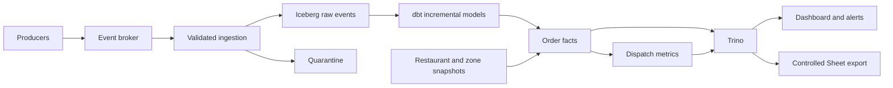

# Nomly Self-Service Event Data Platform

## 1. Executive Summary

Retain immutable raw events; derive order facts and Dispatch metrics through one microbatch path. Analysts own dbt models; the platform owns ingestion and operation.

### Key Decisions

- **Data model:** Raw events, order facts and metric tables in Parquet/Iceberg on object storage.
- **Processing model:** dbt Core incremental models; latency-critical jobs every 2–5 minutes.
- **Self-service interface:** SQL/YAML in a central dbt Core monorepo.
- **Serving:** Trino-compatible SQL, BI dashboard and alerts; controlled Sheets export.
- **Main trade-off:** Target 2–5 minute latency in exchange for one transformation path and lower complexity than separate batch/stream pipelines. Iceberg still adds operational overhead at today's scale.

## 2. Requirements and Assumptions

### Users and Decisions

| User | Need | Decision enabled |
|---|---|---|
| Chiara (Operations) | Detect late-delivery regressions by zone within minutes | Pause or continue the rollout |
| Bea (Product) | Compare Dispatch v2 with the current algorithm | Adjust the rollout percentage |
| Tomek (Analytics) | Query and extend datasets without a platform engineer | Perform and share ad hoc analysis |

### Derived Requirements

| Requirement | Evidence |
|---|---|
| Self-service | Analysts should not need to write consumers |
| Freshness | Problems must be visible “within minutes” |
| Breakdown | Compare algorithms within each zone |
| Event time | Offline-app flushes must not create false spikes |
| Trust | Metrics inform production rollout decisions |

### Assumptions

- **Freshness:** Preliminary data visible within five minutes of broker receipt under normal operation; schedule, commit, transformation and dashboard refresh share this budget.
- **Time:** Use UTC event time for metrics. Provisionally allow automatic corrections for **24 hours after window end**; older changes require backfill. This cutoff limits routine work, not uncertainty about completeness.
- **Metric:** Delivery takes over 45 minutes from placement to delivery. Exclude cancellations; report incomplete orders separately. Product and Operations approve the final definition.
- **Scale and retention:** A few hundred orders/minute today; evaluate at 100x. Provisionally retain raw data for 90 days, subject to replay needs and privacy policy.

### Open Questions

| Question | Owner | Effect on the design |
|---|---|---|
| Late definition, comparison window, minimum sample and alert threshold? | Product and Operations | Metric and rollout decisions |
| Is five-minute freshness sufficient; how late can corrections arrive? | Operations | Schedule and correction window |
| Authoritative reconciliation source and dimension history? | Analytics and source owners | Completeness and historical zone attribution |
| Courier access, retention and availability target? | Security and domain owner | Permissions, lifecycle and recovery budget |

## 3. Architecture

### Data Flow

1. **Ingestion:** Consume registered inputs; acknowledge only after durable raw/quarantine commit. Retries may append duplicates.
2. **Validation and quarantine:** Check envelope and event contract; retain invalid bytes and reason outside curated inputs.
3. **Raw storage:** Preserve payload, `event_id`, event time, ingestion time and source position where available.
4. **Transformation:** Read newly committed raw batches to identify affected orders regardless of event age; filtering new input by event time alone would miss late facts. Deduplicate, merge lifecycle state and recompute affected metric windows within the correction horizon. Advance checkpoints only after success; flag expired windows for backfill.
5. **Serving:** Publish the last successful metric build and its input cutoff. Copy restaurant/zone dimensions on a provisional daily schedule; historical attribution needs versioned mappings.

### Technology Choices

| Layer | Choice | Why | Cost or limitation |
|---|---|---|---|
| Broker | Existing broker; Kafka-compatible log if production needs replay | Avoid unnecessary migration | Retention and throughput need sizing |
| Raw storage | Object storage, Parquet, Apache Iceberg | Compressed columns and auditable history | Small files and maintenance |
| Catalog | Iceberg REST-compatible catalog | Shared table discovery | Catalog availability and access integration |
| Transformation | dbt Core incremental models on Trino | One SQL path for live data and backfill | Adapter compatibility and MERGE cost |
| Curated storage | Iceberg order facts and aggregates | Reusable, correctable tables | Updates rewrite data or add delete files |
| Query engine | Trino | Iceberg reads and writes | Compute and concurrency management |
| Serving | BI dashboard and alerts | Governed metrics | BI refresh consumes freshness budget |

Validate compatibility between dbt, Trino and the chosen catalog before deployment.

### Data Model

| Model | Grain | Purpose | Update pattern |
|---|---|---|---|
| `raw_order_events` | One immutable row per received event; duplicates retained | Audit and replay | Append |
| `fct_orders` | One row per order | Lifecycle, zone and algorithm | Merge affected orders |
| `dispatch_metrics` | Event-time window × zone × algorithm | Rollout monitoring | Replace affected aggregates |

Partition raw by ingestion day, facts by placement day and metrics by window-start day. Use [Iceberg hidden partitioning](https://iceberg.apache.org/docs/latest/partitioning/), not exposed Hive paths; avoid minute-level or high-cardinality partitions. Compact small files from frequent commits.

### Event Timestamps

- **`occurred_at`:** Source-reported business-event time; placement and delivery timestamps determine duration, and delivery time determines the metric window. Preserve it through retries and replay.
- **`ingested_at`:** Platform receipt time for each raw arrival. Its difference from `occurred_at` measures observed arrival delay, subject to source-clock accuracy. Processing/publication time describes pipeline freshness, not when the delivery happened.
- **Clock quality:** UTC standardizes representation; it does not repair inaccurate device clocks. Quarantine invalid timestamps and flag suspect lifecycle timing; never silently substitute ingestion time for event time.

### Event-Level and Order-Level Data

- **Decision:** Keep raw evidence and reusable derived tables.
- **Benefits:** Analysts avoid rebuilding lifecycles; raw data supports new questions and corrections.
- **Costs:** Extra storage, deduplication and mutable fact maintenance.
- **Replay and reprocessing:** Pin raw snapshots, dimension versions and SQL revision; rebuild affected ranges with the same models.
- **Alternatives rejected:** Raw-only repeats complex queries; fact-only loses evidence and replay flexibility.

## 4. Self-Service Interface

### Analyst Experience

1. Reference registered staging models; choose events and fields in SQL.
2. Add dbt YAML with owner, description, contract, tests and freshness class.
3. Open a PR; CI parses, compiles and builds changed models plus downstream dependencies in an isolated schema.
4. Domain owners approve semantics; platform review applies only to shared layers or policy changes.
5. Merge deploys the selected models and publishes dbt documentation.

### Declarative Interface

Analysts use standard dbt SQL and YAML to declare inputs, transformations, output contracts, tests, ownership and freshness class. Registered staging models provide validated, deduplicated events. The platform schedules and deploys the models; no custom configuration language or UI is needed.

### Pull Request Validation

| Check | Failure caught |
|---|---|
| YAML, ownership and policy validation | Invalid config, missing owner or unauthorized exposure |
| dbt parse/compile and isolated build | Broken references, SQL errors and contract mismatch |
| Duplicate, out-of-order and late-event fixtures | Counting and correction regressions |
| Domain tests and incremental-versus-full comparison | Invalid lifecycle or divergent replay results |
| Deployment preview | Unexpected dependencies, scans or schedule changes |

### Deployment Lifecycle

Repository ownership rules route approval. Automated checks use restricted credentials and representative test data. Merge runs the validated revision; failed builds retain the last successful dashboard publication. Rollback restores the previous revision and rebuilds affected outputs. New event sources require platform registration once, not a consumer per analyst.

### AI Reviewer

| Appropriate use | Not trusted for |
|---|---|
| Explain failures; suggest edge cases | Semantic approval |
| Flag suspicious SQL and summarize changes | Access authorization |
| Suggest tests | Replacing deterministic checks or approving deployment alone |

## 5. Dispatch Data Product

### Metric Definition

- **Definition of late delivery:** Late delivered orders / eligible delivered orders; late means duration >45 minutes.
- **Start and end events:** Placement to delivery; provisionally group by five-minute delivery-time windows. Zone comes from placement's restaurant; algorithm from assignment.
- **Cancellations:** Exclude from numerator and denominator; show separately.
- **Incomplete orders:** Show open, overdue (>45 minutes) and missing-event counts alongside delivery rate to expose survivor bias.
- **Late-arriving facts:** Delayed placement or assignment can change duration, eligibility or algorithm attribution, revising historical counts and late rates. Recompute affected aggregates, including previous groups when attribution changes, under the correction policy. Missing placement/assignment remains an explicit quality gap.
- **Metric owner:** Dispatch Product and Operations; Analytics maintains the SQL.

**Example (UTC):** An order placed at 12:00 and delivered at 12:50 has its delivery event arrive at 14:00 after an offline period. Its duration is 50 minutes, so it contributes to delivered and late counts in the 12:50–12:55 window. The arrival creates no 14:00 delivery spike and adds no offline delay to the duration. Until received, that delivery is absent from the rate and the order appears incomplete.

### Dispatch Models

| Model | Grain | Important fields |
|---|---|---|
| `fct_orders` | Order | Placement/delivery times, zone, algorithm, duration, status, quality flags |
| `dispatch_metrics` | Five-minute window × zone × algorithm | Delivered/late counts, late rate, metric version, input cutoff, completeness |

### Serving

- **Dashboard:** Compare v1/v2 by zone, with sample counts and incomplete-order indicators; descriptive differences alone do not establish causality.
- **Refresh interval:** Refresh after successful critical builds, within the five-minute budget.
- **Dimensions and drill-down:** Zone and algorithm; authorized users can inspect affected orders in Trino.
- **Alerts:** Notify Operations on agreed regression thresholds and minimum sample sizes; suppress rollout conclusions when data is stale or incomplete.

### Google Sheets Decision

- **Decision:** Offer Bea's template a bounded aggregate export from the same metric table.
- **Role of a sheet, if any:** Sharing and presentation, with metric version and data timestamp.
- **Why it is or is not the system of record:** Editable cells and independent formulas cannot govern operational metrics.
- **Volume and correctness limitations:** Cap rows, replace the export range and show failed refreshes; keep alerts in BI.

## 6. Correctness and Trust

### Failure Handling

| Failure mode | Handling | User-visible guarantee |
|---|---|---|
| Duplicate event | Deduplicate by `event_id`; quarantine conflicting payloads for the same ID | One contribution per valid event |
| Out-of-order event | Reconstruct affected lifecycle by event time, with deterministic tie-breaking | Arrival order does not define lifecycle |
| Offline-app burst | Aggregate by delivery `occurred_at`; apply correction/backfill policy | Revise historical windows, no ingestion-time delivery spike |
| Malformed payload | Preserve original bytes and reason in quarantine | Auditable rejection; valid inputs continue |
| Missing terminal event | Retain explicit incomplete state | Orders do not silently disappear |
| Replay or backfill | Deterministic models, stable IDs and idempotent merges | No duplicate curated contributions |

### Guarantees and Non-Guarantees

| Area | Guarantee | Explicit limitation |
|---|---|---|
| Freshness | Preliminary results within five minutes under normal operation | Cannot include events still offline at source |
| Completeness | Missing inputs and incomplete orders remain visible | No exactly-once delivery or proof of unobserved events |
| Late-data correction | Automatically revise affected windows for 24 hours after window end, provisionally; retain older arrivals and flag affected windows for backfill | Results remain provisional; expiry does not prove completeness, and older corrections require explicit backfill |
| Availability | Atomic table updates; retain last successful publication | Availability target unagreed; stale data is labelled |

[Iceberg snapshots](https://iceberg.apache.org/docs/latest/reliability/) prevent partial **table** updates, not partial multi-table dbt runs. Publish dashboard results only after required builds/tests succeed; expose pending historical backfills in the correction status.

### Proving the Number

- **Reconciliation source:** Request authoritative order-system counts; event-pipeline agreement alone cannot prove producer completeness.
- **Input-volume check:** Reconcile broker positions/batches with durable raw plus quarantine, accounting for retries. Compare unique valid raw IDs with curated IDs; delivery counts are not unique-event counts.
- **Lifecycle invariants:** Unique IDs, nonnegative durations, valid lifecycle ordering, late ≤ delivered, explicit missing zone/algorithm counts.
- **Comparison with the existing daily report:** Align definition, window and dimensions; investigate differences rather than assuming the report is correct.
- **Check that fails loudly:** Any unexplained reconciliation difference or failed invariant blocks publication and alerts the owner.
- **Evidence shown to Chiara:** Numerator, denominator, metric version, data timestamp and completeness/correction status.

## 7. Platform Ownership and Onboarding

### Ownership Boundaries

| Platform team owns | Product team owns |
|---|---|
| Ingestion, staging, runtime and shared macros | Domain marts and metric semantics |
| Shared contracts, reliability and permissions | Domain tests and acceptance criteria |
| Catalog, deployment and incident tooling | Documentation and domain-quality response |

Repository ownership: platform owns staging; intermediate models have shared ownership; Dispatch and Payments own their respective marts. Required reviewers follow these boundaries.

### Onboarding Teams 2-10

1. Register domain owner and access policy.
2. Reuse a supported dbt model template and registered inputs.
3. Add domain SQL, contracts and tests.
4. Validate and deploy through the same PR path.
5. Publish documentation, freshness class and alert ownership.

### Preventing Bespoke Pipelines

- **Standard interfaces:** Shared staging contracts and dbt SQL/YAML.
- **Supported extension points:** Domain models and tests; reviewed shared macros for dialect differences.
- **Criteria for changing the platform:** A demonstrated shared need; federate dbt projects only when CI or release contention is measurable.
- **Deprecation policy:** Version breaking interfaces, identify dependants and agree migration before removal.

## 8. Operations, Schema Evolution, and Security

### Observability

Thresholds below are provisional operating rules.

| Signal | Threshold | Response |
|---|---|---|
| Queue lag | Endangers five-minute budget | Platform investigates consumer/commit backlog |
| Data freshness and arrival delay | Publication >5 minutes old; source delay exceeds correction window | Mark stale; distinguish pipeline delay from offline sources |
| Invalid-event rate | Any rejected events initially | Notify source owner; tune alert after baseline |
| Transformation failures | Any critical build failure | Retain prior publication; retry or roll back |
| Reconciliation failures | Any unexplained difference | Block publication; investigate with domain owner |

### Schema Evolution

- **Additive fields:** Preserve in raw; expose deliberately through staging and domain PRs.
- **Breaking changes:** Version contracts and migrate consumers; quarantine incompatible payloads.
- **Compatibility validation:** CI builds downstream dependants against changed schemas.
- **Backfill behavior:** Reprocess selected retained history; never invent fields absent from old payloads.

### Access Control

- **Model:** Domain roles and least-privilege service accounts; restricted raw/quarantine access.
- **Treatment of `courier_id`:** Restricted identifier; omit from default metrics and grant detailed access only for approved purposes.
- **Auditability:** Record access, model revisions, deployments and exports. “Immutable” means append-only processing within approved retention/deletion policy.

## 9. Scale and Cost

### Current Scale

- **Throughput:** Illustratively, 300 orders/minute × 5 events ≈1,500 events/minute; at 100x ≈150,000. Actual lifecycle counts vary.
- **Freshness:** Run only the critical dbt selector every 2–5 minutes; measure the entire publication path.
- **Storage profile:** At an assumed 1 KB/event, ≈2.2 GB/day today or 216 GB/day at 100x before compression, retries and derived tables.
- **Compute profile:** Trino transforms and queries; compaction adds work. No defensible price estimate until compression, scans and concurrency are measured; benchmark cost per million events and dashboard query.

### At 100x Scale

| Concern | What breaks first | Mitigation |
|---|---|---|
| Ingestion | Commit backlog and small batches | Batch writes; partition broker/workers only when throughput requires |
| Storage layout | Small files and metadata growth | Compact files and expire snapshots |
| Transformation | Fact MERGEs and critical DAG duration; CI contention | Bound correction lookbacks, prune affected partitions, select critical models |
| Query concurrency | Repeated detailed-fact scans | Materialized dashboard aggregates; isolate interactive compute |
| Replay capacity | Full-history rebuild duration | Scoped backfills on separate compute with progress checkpoints |

### Cost Controls

- Enforce approved retention; expire snapshots without shortening the promised replay window.
- Use daily partitions and measured compaction targets; avoid frequent full scans.
- Separate interactive, transformation and maintenance compute; set scan/concurrency limits.
- Parquet/Iceberg support multiple engines; dbt Core/Git avoid a dbt Cloud dependency. Another Iceberg reader can replace Trino, but writes, catalog integration, SQL dialect and operations still cost effort to migrate. Keep dialect-specific SQL in a small macro layer.

## 10. Thin Working Slice

### Scope

**Proposed, not yet implemented or run.** Production architecture above is separate from the harness slice.

- **Event type:** `courier_assigned`, demonstrating v1/v2 assignment share.
- **Configuration:** The same dbt SQL/YAML interface described in section 4, using a registered assignment-event source.
- **Flow:** RabbitMQ → generic ingestion → Postgres raw events → dbt/Postgres model.
- **Idempotency mechanism:** Enforce unique event IDs in Postgres and acknowledge only persisted inputs. Replaying the same captured input twice must leave counts and results unchanged.

### Result

For an explicit event-time window, report unique assignments, unique v2 assignments and v2 percentage. An empty window has no percentage.
- **Observation window:** Unset until execution; harness event time runs at 60x wall time.
- **Result:** Unset until execution.
- **Independent validation:** Capture input IDs; independently count unique valid assignments/v2 IDs for that window, then compare table and replay results.
- **Why the number is credible:** Evidence is pending; expected producer proportions are not validation.

### Slice Limitations

- **Production-like aspects:** SQL/YAML interface, event-time query and idempotent curated results.
- **Harness-specific shortcuts:** Postgres deduplicates raw rows, unlike production audit storage; the small dataset is rebuilt each run. One event type cannot calculate late delivery by zone: that needs placement, assignment, delivery and restaurant/zone data, plus cancellation handling.
- **First failure expected after one unattended week:** Unbounded raw growth/full rebuild time; faster harness timestamps also invalidate wall-clock lateness checks.
- **On-call response:** Check queue lag, commit/build failures and disk; restore capacity, replay safely, then add retention and incremental processing as needed.

## 11. Next Steps and Deliberate Cuts

### Next Steps

1. Agree metric semantics, correction/retention windows and freshness objectives with Dispatch.
2. Implement and run the slice; record observed window, query result and replay/reconciliation evidence.
3. Benchmark the critical path and cost at current/100x load before committing to production sizing.

### Deliberately Cut

| Cut | Reason | Trigger to add it |
|---|---|---|
| Stateful stream processor | No sub-minute SLO | Object-store commit latency plus critical dbt DAG cannot meet agreed freshness |
| Custom UI/config compiler | Analysts already write SQL | Demonstrated workflow gap in dbt/Git |
| dbt Semantic Layer | Portable metric tables suffice | Repeated cross-tool metric inconsistencies |
| Federated dbt mesh | One repo simplifies ownership and deployment | Measured CI or release contention |
| Sheets as system of record | Editable exports cannot govern metrics | None; keep it an export |
| Full-history replay on every change | Wasteful at scale | Explicit semantic correction or recovery need |

## Appendix: Alternatives Considered

| Decision | Chosen option | Alternative | Why rejected |
|---|---|---|---|
| Storage | Iceberg | Naked Hive-partitioned Parquet | Atomicity and metadata would become platform-owned problems |
| Table format | Iceberg | Delta | Prefer engine-neutral operation; Spark/Databricks-oriented tooling offers no demonstrated advantage here, though Delta is also open |
| Processing | Microbatch dbt | Flink | Defer until the freshness budget requires stateful streaming |
| Processing paths | One replayable SQL path | Lambda architecture | Separate batch/stream logic can drift |
| Metrics | Materialized tables | dbt Semantic Layer | Defer added serving dependency |
| Analyst interface | dbt SQL/YAML | Custom UI/config compiler | Duplicates existing analyst tooling |
