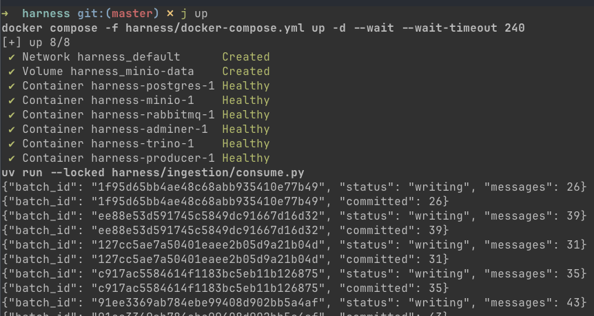
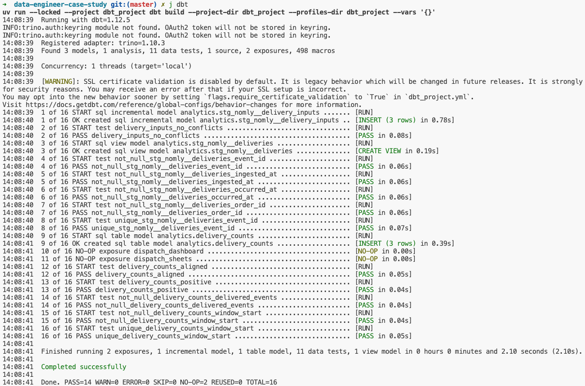
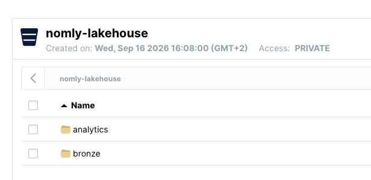
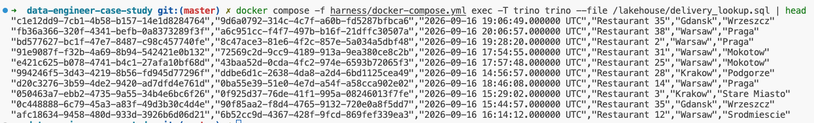

# Data Engineering case study

Events flow from RabbitMQ through a batch consumer and Trino into Iceberg/Parquet in MinIO.

Requires **Docker Compose 2.30+**, **uv** and **just**. From the repository root:

```bash
just up
```

Starts the stack and consumes continuously, printing committed batch counts.
After the first committed batch, check from another terminal:

```bash
just check
just dbt    # Build and test delivery-event counts.
just dbt-test    # Recheck existing models without rebuilding.
just dbt-verify  # Build, then verify replay, conflicts and time-window assumptions.
```

Shows row count and latest receipt, requires data from the last 60 seconds, and checks
a Parquet object in MinIO. This verifies ingestion, not event validity or deduplication.
dbt incrementally captures delivery inputs, deduplicates them, then rebuilds `lakehouse.analytics.delivery_counts`,
using five-minute UTC occurrence windows. A failed build leaves previous counts stale.
Incremental input runs scan today and yesterday (UTC ingestion dates); longer gaps need a wider window/backfill.

Browse [MinIO](http://localhost:9001): `nomlyadmin` / `nomly-local-only`, bucket `nomly-lakehouse`.

Press **Ctrl-C** to stop ingestion, then choose:

```bash
just stop  # Preserve data; resume with just up.
just nuke  # DELETE harness database, broker and MinIO data; start fresh with just up.
```

Ingestion scripts declare their own Python 3.12/dependencies in uv inline metadata,
with per-script lockfiles; no Python project setup is needed.

Unattended, queue backlog and small files grow. Monitor disk usage; restart failed
ingestion with `just up`. Retries can produce duplicate raw rows.

Read the [brief](CASE_STUDY.md), [design](DESIGN.md), or
[harness instructions](harness/HARNESS.md) for connections, SQL and verification commands.
The brief's final Postgres output remains deferred.

## Quick start

### Step 1
Run the docker compose `just up`. Start producing and consuming events.



## Step 2
Run dbt model with `just dbt`.



## Step 3
Verify storage layer at [local Minio instance](localhost:9000)



## Step 4
Run Trino verification query


