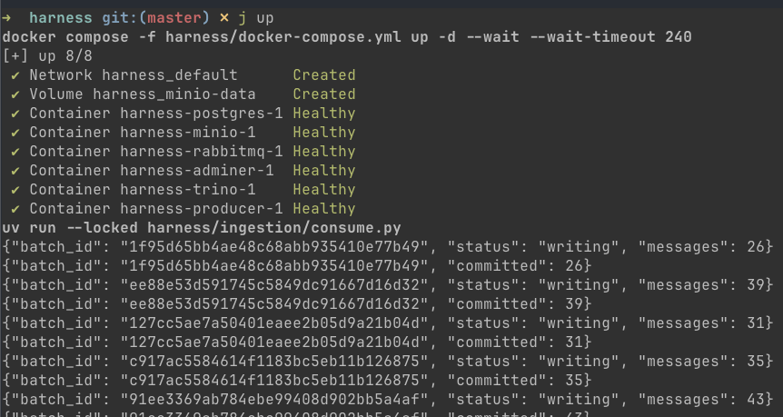
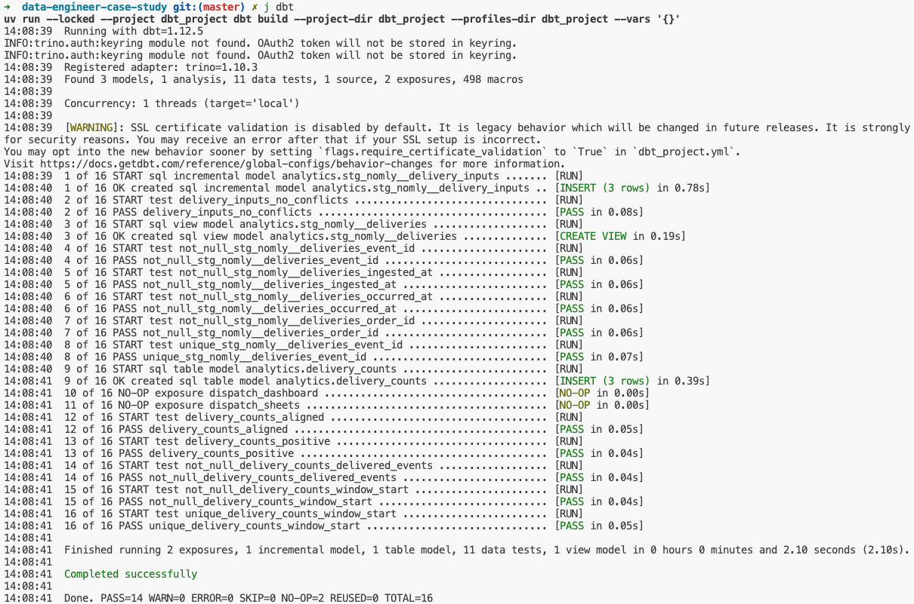
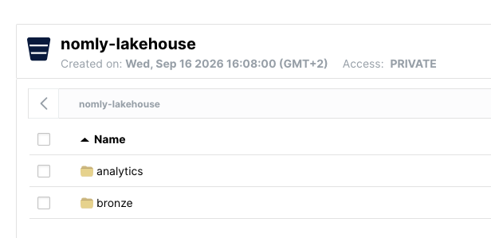
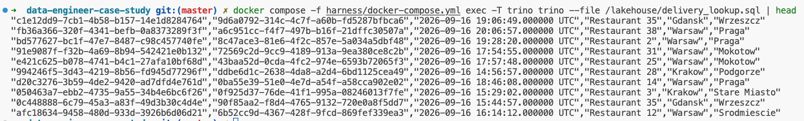

# Data Engineering case study

Events flow from RabbitMQ through a batch consumer and Trino into Iceberg/Parquet in MinIO.

Requires **Docker Compose 2.30+**, **uv** and **just**. From the repository root:

```bash
just up
```

Starts the stack and consumes continuously, printing committed batch counts.
After the first committed batch, check from another terminal:

```bash
just check
just dbt    # Build and test delivery-event counts.
just dbt-test    # Recheck existing models without rebuilding.
just dbt-verify  # Build, then verify replay, conflicts and time-window assumptions.
```

Shows row count and latest receipt, requires data from the last 60 seconds, and checks
a Parquet object in MinIO. This verifies ingestion, not event validity or deduplication.
dbt incrementally captures delivery inputs, deduplicates them, then rebuilds `lakehouse.analytics.delivery_counts`,
using five-minute UTC occurrence windows. A failed build leaves previous counts stale.
Incremental input runs scan today and yesterday (UTC ingestion dates); longer gaps need a wider window/backfill.

Browse [MinIO](http://localhost:9001): `nomlyadmin` / `nomly-local-only`, bucket `nomly-lakehouse`.

Press **Ctrl-C** to stop ingestion, then choose:

```bash
just stop  # Preserve data; resume with just up.
just nuke  # DELETE harness database, broker and MinIO data; start fresh with just up.
```

Ingestion scripts declare their own Python 3.12/dependencies in uv inline metadata,
with per-script lockfiles; no Python project setup is needed.

Unattended, queue backlog and small files grow. Monitor disk usage; restart failed
ingestion with `just up`. Retries can produce duplicate raw rows.

Read the [brief](CASE_STUDY.md), [design](DESIGN.md), or
[harness instructions](harness/HARNESS.md) for connections, SQL and verification commands.
The brief's final Postgres output remains deferred.

## Quick start

### Step 1
Run the docker compose `just up`. Start producing and consuming events.



## Step 2
Run dbt model with `just dbt`.



## Step 3
Verify storage layer at [local Minio instance](localhost:9000)



## Step 4
Run Trino verification query

```
docker compose -f harness/docker-compose.yml exec trino trino
```

Then in Trino:

```sql
SHOW SCHEMAS FROM lakehouse;

SELECT table_schema, table_name, table_type
FROM lakehouse.information_schema.tables
WHERE table_schema IN ('bronze', 'analytics')
ORDER BY table_schema, table_name;

DESCRIBE lakehouse.bronze.raw_order_events;
SELECT file_path, file_format, record_count
FROM lakehouse.bronze."raw_order_events$files"
LIMIT 10;
```



## Demo: follow the data

In the Trino CLI from Step 4, run these in order. Run `just dbt` in another
terminal first; an unsuccessful build leaves the previous analytics counts stale.

1. **Bronze — all events arrive as raw bytes.** Compare receipt time with the
   event's own timestamp. Decode the payload for display; malformed JSON is
   shown as text rather than silently excluded.

   ```sql
   SELECT routing_key, count(*) AS raw_rows, max(ingested_at) AS latest_receipt
   FROM lakehouse.bronze.raw_order_events
   GROUP BY 1 ORDER BY 1;

   SELECT ingested_at, routing_key,
          json_extract_scalar(try(json_parse(from_utf8(payload))), '$.occurred_at') AS occurred_at,
          coalesce(json_format(try(json_parse(from_utf8(payload)))),
                   from_utf8(payload)) AS payload_text
   FROM lakehouse.bronze.raw_order_events
   ORDER BY ingested_at DESC LIMIT 10;
   ```

2. **Captured delivery inputs — validate candidate events.** A null rejection
   reason means the candidate passed validation.

   ```sql
   SELECT count(*) AS candidate_rows,
          count_if(rejection_reason IS NULL) AS valid_rows,
          count_if(rejection_reason IS NOT NULL) AS rejected_rows,
          max(ingested_at) AS latest_captured_receipt
   FROM lakehouse.analytics.stg_nomly__delivery_inputs;

   SELECT rejection_reason, count(*) AS rows
   FROM lakehouse.analytics.stg_nomly__delivery_inputs
   GROUP BY 1 ORDER BY rows DESC;
   ```

3. **Delivery detail — remove identical event-ID retries.** The input table
   retains duplicates; the view exposes validated, deduplicated events.

   ```sql
   SELECT count(*) AS valid_input_rows,
          count(DISTINCT event_id) AS distinct_event_ids
   FROM lakehouse.analytics.stg_nomly__delivery_inputs
   WHERE rejection_reason IS NULL;

   SELECT event_id, order_id, occurred_at, ingested_at
   FROM lakehouse.analytics.stg_nomly__deliveries
   ORDER BY occurred_at DESC LIMIT 10;
   ```

4. **Delivery counts — group by five-minute occurrence-time windows.** Check
   that published counts reconcile with the detail after a successful build.

   ```sql
   SELECT window_start, delivered_events
   FROM lakehouse.analytics.delivery_counts
   ORDER BY window_start DESC LIMIT 10;

   SELECT count(*) AS detail_events,
          (SELECT coalesce(sum(delivered_events), 0)
           FROM lakehouse.analytics.delivery_counts) AS counted_events
   FROM lakehouse.analytics.stg_nomly__deliveries;
   ```

For the physical side, the `raw_order_events$files` query in Step 4 lists the
Parquet objects; browse them in the `nomly-lakehouse` bucket in [MinIO](http://localhost:9001).
